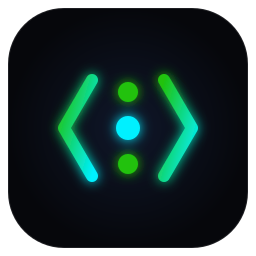

<div align="center">



# `devctx`

### Sub-Millisecond AST Context Engine & Model Context Protocol (MCP) Server for AI Coding Agents

[](https://github.com/recscse/devctx/releases)
[](https://golang.org)
[](https://modelcontextprotocol.io)
[](LICENSE)

<br/>

**Stop letting AI coding assistants burn millions of tokens on brute-force grep.**<br/>
`devctx` indexes AST symbols into an embedded SQLite database (WAL mode) and serves exact code signatures, skeletons, and call graphs to **Claude Code, Cursor, Windsurf, Google Antigravity, and VS Code** in `< 2ms`.

<br/>

[Website](https://recscse.github.io/devctx/) • [Documentation](https://recscse.github.io/devctx/docs.html) • [Engineering Blog](https://recscse.github.io/devctx/blog.html) • [14 MCP Tools](#-14-specialized-mcp-tools) • [Architecture Deep-Dive](docs/ARCHITECTURE.md)

</div>

---

## 💡 The Core Problem: Why Grep Fails for AI Agents

When an AI coding assistant explores your codebase, its default fallback is raw `grep` and dumping entire 2,000-line files:

1. **Massive Token Waste**: A single `grep` for a common term (e.g. `GenerateToken`, `handleAuth`) returns hundreds of lines across mocks, test fixtures, and comments (burning 3,000–8,000 tokens).
2. **Compound Transcript Re-Sending**: Because LLM API calls are stateless, **the full conversation history is re-sent on every subsequent turn**. Paying for 8,000 noisy tokens on Turn 1 means paying for them again on Turn 2, Turn 3... Turn 15 (burning 100,000+ tokens for a single refactoring task).
3. **Context Window Drift**: Flooding the context window with raw text degrades model attention, leading to hallucinated method signatures and broken callers.

### The `devctx` Solution:
`devctx` parses Abstract Syntax Trees (AST) across **Go, TypeScript/JavaScript, Python, and Rust**, indexing declarations, signatures, and call hierarchies into local SQLite. Your AI coding agent receives exact definitions, function skeletons, and call graphs in **1 turn and 250 tokens**.

```text
┌───────────────────────────────────────────────────┐     ┌───────────────────────────────────────────────────┐
│  ❌ TRADITIONAL BRUTE-FORCE GREP FLOW              │     │  ⚡ DEVCTX LOCAL AST CONTEXT ENGINE FLOW          │
├───────────────────────────────────────────────────┤     ├───────────────────────────────────────────────────┤
│  Turn 1: grep -rn "GenerateToken" .               │     │  Turn 1: devctx:pack_feature_context("auth")      │
│  └── 380 lines across mocks (4,200 tokens)        │     │  └── Bundled models, handlers & tests (240 tokens)│
│                                                   │     │                                                   │
│  Turn 2: view_file auth_service.go                │     │  Turn 1 (cont): devctx:find_callers(...)          │
│  └── 2,100-line full file dump (5,200 tokens)     │     │  └── Pinpointed all 3 callers in 2ms (18 tokens)  │
│                                                   │     │                                                   │
│  Turn 3–6: Guess edit ➔ 3 callers broke on import! │     │  Turn 2: Targeted edit applied & verified         │
│  └── Retry loops & hallucinated signatures        │     │  └── 100% test pass on first attempt              │
├───────────────────────────────────────────────────┤     ├───────────────────────────────────────────────────┤
│  TOTAL: 15 turns | ~64,000 tokens | 62s ($0.19)   │     │  TOTAL: 2 turns | ~2,100 tokens | 4s ($0.006)     │
└───────────────────────────────────────────────────┘     └───────────────────────────────────────────────────┘
                                                           🚀 96% Token Savings • 5x Faster Turnaround
```

---

## ⚡ Quick Install (1-Liner)

### macOS & Linux
```bash
curl -fsSL https://recscse.github.io/devctx/install.sh | bash && devctx setup
```

### Windows (PowerShell)
```powershell
irm https://recscse.github.io/devctx/install.ps1 | iex; devctx setup
```

### Go Developers
```bash
go install github.com/recscse/devctx@latest && devctx setup
```

> **Note**: Running `devctx setup` automatically detects installed AI tools (**Claude Desktop, Cursor, Google Antigravity, Windsurf, VS Code**) and registers the MCP server with `autoApprove: true` — zero manual configuration needed.

---

## 🛠️ 14 Specialized MCP Tools

AI agents connected to `devctx` execute 14 token-optimized tools:

| MCP Tool | Purpose | Real Token Impact |
| :--- | :--- | :---: |
| **`pack_feature_context`** | 1-Shot bundle of feature data models, entrypoints, test suites & skeletons | **~240 tokens (vs 8,000)** |
| **`get_file_skeleton`** | Strips function bodies into `{ /* L45-L92 */ }` comments | **~50 tokens (vs 5,000)** |
| **`blast_radius`** | Answers *"If I change this symbol, what breaks?"* before applying refactors | **Zero Broken Callers** |
| **`find_symbol`** | Locates exact definition line numbers and signatures across all files | **< 2ms Latency** |
| **`find_callers`** | Discovers all call sites and functions invoking a target symbol | **100% Graph Precision** |
| **`find_callees`** | Discovers internal functions and types called inside a function | **Exact Call Stack** |
| **`find_tests_for`** | Automatically finds corresponding test files & test functions | **Instant Test Pairing** |
| **`save_decision`** | Durable SQLite store for architectural invariants (agent memory) | **Persistent Memory** |
| **`get_decisions`** | Retrieves past architectural invariants matching a topic | **Zero Bug Recurrence** |
| **`get_repo_map`** | Structural repo skeleton with strict token-budget protection | **Budget Protected** |
| **`get_git_changes`** | AST-aware git diff summary (maps changed lines to functions/classes) | **Clean Diffs** |
| **`search_code`** | Symbol-boosted FTS5 full-text search with snippet highlights | **Noisy Lines Removed** |
| **`read_file_context`** | Reads file with prepended AST symbol declarations | **Full File Context** |
| **`find_references`** | Universal cross-file reference and usage discovery | **Complete Usages** |

---

## 🔒 Security & Privacy Guarantees

- **100% Local-First**: All indexing and searches run on your local machine in SQLite (`.devctx/index.db`).
- **Zero Cloud Telemetry**: Source code and AST symbols are never uploaded to any remote server.
- **Path Traversal Protection**: All file read operations are validated strictly within the repository boundary.
- **Zero Elevated Privileges**: Runs entirely in user space without requiring root or administrator access.

---

## 💻 CLI Commands Reference

```bash
# Initialize and index a repository into SQLite
devctx init

# Search AST symbols instantly (< 2ms)
devctx search "PaymentProcessor"

# PR Blast Radius regression analyzer
devctx blast "GenerateToken"

# 1-shot feature context packing
devctx pack auth

# Launch local interactive visual network graph in browser
devctx map --web

# View real-time token & dollar savings counter
devctx stats

# Run system health and MCP diagnostics
devctx doctor

# Auto-configure MCP in installed AI coding assistants
devctx setup
```

---

## 📄 License

`devctx` is open-source software licensed under the [MIT License](LICENSE).
