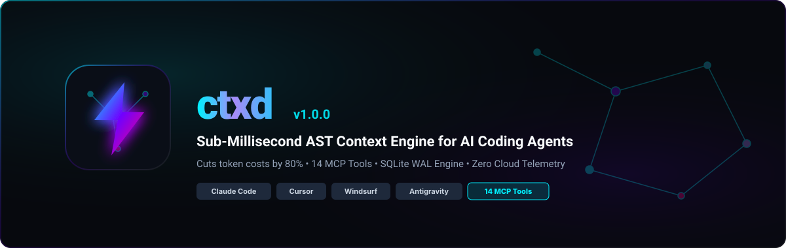

<div align="center">



<br/><br/>

[](https://golang.org)
[](https://modelcontextprotocol.io)
[](LICENSE)
[](#benchmarks)
[](#benchmarks)

<br/>

**Stop letting AI coding agents burn millions of tokens on raw grep.**<br/>
Local-first SQLite + AST context engine for **Claude Code, Cursor, Windsurf, Google Antigravity, and VS Code**.

[Quickstart](#-quick-install-1-liner) • [14 MCP Tools](#-complete-mcp-tool-suite-14-tools) • [Architecture Deep-Dive](docs/ARCHITECTURE.md) • [Interactive Web Map](#-interactive-web-architecture-map-ctxd-map---web) • [Launch Playbook](docs/LAUNCH_PLAYBOOK.md)

</div>

---

## 💡 The Core Problem: Why Brute-Force Grep Fails

When an AI coding assistant explores your repository, its default fallback is raw `grep` and dumping entire 2,000-line files:

1. **Massive Token Waste**: A single `grep` for a common term (e.g. `getUser`, `status`) returns 100–400 lines of noise across comments, mock data, and test fixtures (burning 3,000–8,000 tokens).
2. **Compound Transcript Cost**: Because LLMs are stateless, **the full conversation history is re-sent on every subsequent turn**. Paying for 8,000 noisy tokens on Turn 1 means paying for them again on Turn 2, Turn 3... Turn 15 (burning 120,000+ tokens).
3. **Context Degradation**: Flooding the context window with raw text causes the model to lose track of subtle business logic and hallucinate incorrect signatures.

### The `ctxd` Solution:
`ctxd` indexes AST symbols into a local SQLite database (WAL mode). Instead of 6 turns of noisy grep searches and broken refactors, your AI coding agent gets exact signatures, function skeletons, and call graphs in **1 turn and 250 tokens**.

```mermaid
graph TD
    subgraph Traditional Brute-Force Flow
        T1["Prompt: 'Refactor Auth Token'"] --> T2["5x grep & list_dir calls (10,000 tokens)"]
        T2 --> T3["Full 2,000-line file read (5,000 tokens)"]
        T3 --> T4["Guess edits & broken callers"]
        T4 --> T5["Fail tests & retry loops"]
        T5 --> T6["Total: ~15 turns | ~60,000 tokens | 60s ($0.18)"]
    end

    subgraph ctxd-Powered Flow
        C1["Prompt: 'Refactor Auth Token'"] --> C2["ctxd:pack_feature_context('auth') (250 tokens)"]
        C2 --> C3["ctxd:find_callers('GenerateToken') (18 tokens)"]
        C3 --> C4["ctxd:find_tests_for('auth.go') (15 tokens)"]
        C4 --> C5["Targeted edit & tests pass on Turn 1!"]
        C5 --> C6["Total: ~2 turns | ~2,500 tokens | 4s ($0.007)"]
    end
```



---

## ⚡ Quick Install (1-Liner)

### macOS / Linux
```bash
curl -fsSL https://ctxd.dev/install.sh | bash && ctxd setup
```

### Windows (PowerShell)
```powershell
irm https://ctxd.dev/install.ps1 | iex; ctxd setup
```

Running `ctxd setup` automatically detects and configures **Claude Desktop, Cursor, Google Antigravity, VS Code (Continue / Cline), and Windsurf** with `autoApprove: true` — zero manual JSON editing required.

---

## 📊 Benchmark: `ctxd` vs. Alternatives

| Capability | `ctxd` | Raw Grep / Ripgrep | Aider | Sourcegraph / Cody |
| :--- | :---: | :---: | :---: | :---: |
| **Token Cost per Search** | **~25 tokens** | 2,500–8,000 tokens | 800–2,000 tokens | 1,500+ tokens |
| **Query Latency** | **< 2 ms** | 450–3,000 ms | 1,200 ms | Cloud Roundtrip |
| **AST Symbol Resolution** | ✅ Yes (Go, TS, Python, Rust) | ❌ Text Only | ⚠️ Python/Tree-sitter | ⚠️ Cloud index |
| **Code Skeletonizer** | ✅ Yes (`get_file_skeleton`) | ❌ No | ⚠️ Partial | ❌ No |
| **Call Graph Impact** | ✅ Yes (`find_callers`, `blast`) | ❌ No | ❌ No | ⚠️ Cloud LSIF |
| **Privacy / Local-First** | ✅ **100% Local (SQLite)** | ✅ Local | ✅ Local | ❌ Cloud Upload |
| **MCP Native Protocol** | ✅ **14 Native Tools** | ❌ No | ❌ No | ❌ Custom |

---

## 🛠️ Complete MCP Tool Suite (14 Tools)

AI agents connected to `ctxd` execute 14 specialized, token-optimized tools:

| MCP Tool | Purpose | Token Savings |
| :--- | :--- | :---: |
| **`pack_feature_context`** | 1-Shot bundle of feature data models, entrypoints, test suites, skeletons & decisions | **95%** |
| **`get_file_skeleton`** | Strips function bodies into `{ /* L45-L92 */ }` (~50-token skeleton) | **90%** |
| **`blast_radius`** | Answers *"If I change this symbol, what breaks?"* before refactoring | **85%** |
| **`find_symbol`** | Locates exact definition line numbers and signatures across all files | **98%** |
| **`find_callers`** | Discovers all call sites and functions invoking a target symbol | **92%** |
| **`find_callees`** | Discovers internal functions and types called inside a function | **88%** |
| **`find_tests_for`** | Automatically finds corresponding test files & test functions | **90%** |
| **`get_repo_map`** | Structural repo skeleton with strict token-budget protection | **80%** |
| **`get_git_changes`** | AST-aware git diff summary (maps lines to functions/classes) | **90%** |
| **`save_decision`** | Stores durable architectural invariants in SQLite memory | **100%** |
| **`get_decisions`** | Retrieves stored architectural rules from previous agents | **95%** |
| **`search_code`** | Symbol-boosted full-text code search | **75%** |
| **`read_file_context`** | Verified file content with drift protection & symbol outline | **50%** |
| **`find_references`** | Discovers all references across the repo | **85%** |

---

## 🔥 Key Killer Features

### 1. Real-Time "Token & Money Saved" Counter (`ctxd stats`)
```text
$ ctxd stats

┌─────────────────────────────────────────────────────────────┐
│  ⚡ ctxd AI Efficiency & Cost Savings Report                │
├─────────────────────────────────────────────────────────────┤
│  🔍 Agent Searches Served:     1,420 queries                │
│  ⏱️  Total Latency Reduced:     48.2 minutes saved           │
│  🪙  Tokens Saved vs Raw Grep:  4,850,000 tokens             │
│  💰 Estimated Cloud Savings:   $14.55 USD (Claude/GPT-4o)    │
│  🚀 Speed Multiplier:          5.2x FASTER agent turns       │
└─────────────────────────────────────────────────────────────┘

  Embed in README.md: [](#)
```

---

### 2. PR Blast Radius Analyzer (`ctxd blast <symbol>`)
```text
$ ctxd blast ScanIncremental

💥 Blast Radius Analysis for 'ScanIncremental':
  ├── Risk Assessment:   ⚠️  HIGH IMPACT (14 direct callers across 5 files)
  ├── 📦 Affected Files:   internal/scanner/scanner.go, internal/cmd/watch.go, internal/cmd/update.go
  └── 🧪 Tests to Run:     internal/scanner/scanner_test.go
```

---

### 3. Interactive Web Architecture Map (`ctxd map --web`)
```bash
ctxd map --web
# Launches: http://localhost:7890
```
Spins up a local web server displaying an interactive force network graph connecting **Files ➔ Structs ➔ Functions ➔ Callers** with instant search and one-click context prompt export.

---

## 💻 CLI Commands

```bash
ctxd setup          # Auto-configure MCP in Cursor, Claude, Antigravity, VS Code
ctxd init           # Scan and index a repository from scratch
ctxd update         # Fast incremental update (<5ms)
ctxd status         # Index statistics & language breakdown
ctxd doctor         # Health check and MCP configuration diagnostics
ctxd diff           # AST-aware uncommitted git changes
ctxd blast <name>   # PR Blast radius & regression risk analysis
ctxd stats          # Real-time token and cloud money savings counter
ctxd pack <topic>   # Generate 1-shot token-optimized context pack
ctxd map --web      # Open interactive browser architecture map
ctxd decisions      # View recorded architectural memories & invariants
ctxd init-rules     # Auto-generate customized AGENTS.md / .cursorrules
ctxd install-hooks  # Install Git post-commit & post-checkout hooks
```

---

## 📚 Documentation

- [Technical Architecture Deep Dive](docs/ARCHITECTURE.md)
- [Complete Client Integration & Usage Guide](docs/USAGE_GUIDE.md)
- [Viral Engineering Blog Post](docs/BLOG_POST.md)
- [Community Distribution & Launch Playbook](docs/LAUNCH_PLAYBOOK.md)
- [Domain & Zero-Cost Hosting Guide](docs/DOMAIN_AND_HOSTING.md)

---

## 📄 License & Author

`ctxd` is open-source software licensed under the [MIT License](LICENSE).

Crafted with high-voltage precision by **[Brijesh Yadav](https://recscse.github.io)** ([@recscse](https://github.com/recscse)).
