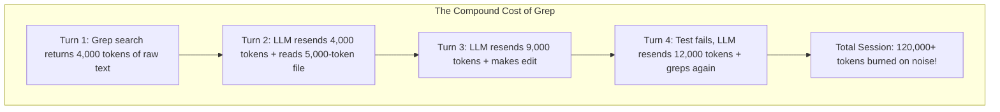

# Why Brute-Force Grep Destroys AI Coding Performance
### *And how local SQLite + AST indexing cuts agent token costs by 80%*

**By the devctx Team** • 8 min read

---

If you’ve used Cursor, Claude Code, Windsurf, or Google Antigravity on a production codebase with more than 10,000 lines of code, you’ve probably noticed an infuriating pattern:

1. You ask the agent a simple question: *"Where is the webhook signature verified?"*
2. The agent sits there for 20–30 seconds.
3. The UI flashes: `Calling grep_search... Calling list_dir... Reading webhook.py (1,800 lines)... Calling grep_search again...`
4. The agent finally answers, but your token usage for that single prompt jumped by **15,000 tokens ($0.05 - $0.15)**.
5. In a 10-turn coding session, you just spent **$1.50** on raw search noise.

Why is this happening, why does it break LLM reasoning, and how can we solve it permanently?

---

## 1. The Math Behind the "Token Incinerator"

AI coding assistants are powered by frontier LLMs (Claude 3.5 Sonnet, GPT-4o, DeepSeek-Coder). These models are fundamentally **stateless**:

> **On every turn of a conversation, the client application resends the entire conversation history back to the model.**

When an AI agent runs a raw `grep` or `ripgrep` command:
- It returns 100 to 400 lines of matching text across comments, mock data, build logs, and test fixtures.
- That one search injects **3,000 to 8,000 tokens** directly into the conversation transcript.
- On Turn 2, you pay for those 8,000 tokens. On Turn 3, you pay for them again. On Turn 10, you are still paying for that initial grep output!



Beyond the financial cost, dumping thousands of lines of irrelevant code into the context window causes **context degradation (the 'needle in a haystack' problem)**: the model loses track of subtle business logic and hallucinates incorrect function arguments.

---

## 2. How Modern Context Engines Approach the Problem

Major AI labs and tools take different approaches to context:

- **Anthropic's Model Context Protocol (MCP)**: Established a universal JSON-RPC protocol over standard I/O, allowing IDEs to connect to specialized local context servers.
- **Cursor's Indexer**: Builds Merkle trees and remote embeddings in the cloud to index symbols and files.
- **Aider's Repository Map**: Uses Tree-sitter to build an in-memory graph of syntax tags and applies PageRank to fit symbol signatures into a tight prompt budget.

However, developers working in enterprise environments often face strict constraints:
- **Zero Cloud Uploads**: Proprietary enterprise code cannot be uploaded to remote embedding servers.
- **Zero Latency**: Agents need responses in `< 5ms`, not waiting for cloud vector API roundtrips.
- **Multi-Editor Freedom**: The index must work identically in Cursor, Claude Desktop, Antigravity, VS Code, and Windsurf.

---

## 3. Introducing `devctx`: Local-First SQLite + AST Architecture

`devctx` is a lightweight, open-source context engine and MCP server written in Go. It operates on a simple premise: **Treat your repository's AST as a fast, queryable local relational database.**

### The Architecture:
1. **Sub-Millisecond AST Extraction**: Deterministically extracts functions, types, interfaces, and classes across Go, TypeScript, Python, and Rust.
2. **SQLite WAL Mode Storage (`.devctx/index.db`)**: Stores file hashes, AST symbols, and full-text search indexes with zero database locking (`PRAGMA synchronous = NORMAL`).
3. **Line-Number Drift Protection**: Checks file modification timestamps on every query. If an agent edits a file during a session, `devctx` micro-reparses that single file in $<2\text{ms}$, guaranteeing line numbers are never stale.

---

## 4. Four Breakthrough Features That Change the Developer Experience

### A. The "Code Skeletonizer" (`get_file_skeleton`)
Instead of dumping all 2,000 lines of a file (5,000 tokens), `get_file_skeleton` strips function bodies and retains only the signatures and structure:

```go
type PaymentProcessor struct { ... }
func NewProcessor(cfg Config) *PaymentProcessor { ... }
// ProcessPayment handles Stripe webhook events
func (p *PaymentProcessor) ProcessPayment(ctx Context, event Event) (Result, error) { /* L45-L92 */ }
```
**Impact**: Turns a 5,000-token file into a **50-token skeleton**. The AI agent targets its edit directly to lines 45–92 with pinpoint accuracy.

---

### B. One-Shot Feature Packer (`pack_feature_context`)
In traditional workflows, starting work on a feature requires 5 separate tool calls (router ➔ model ➔ schema ➔ test file ➔ implementation).

`pack_feature_context("auth")` bundles:
- Related data models & structs
- Related entrypoints & functions
- Matching test suites (`auth_test.go`)
- Structural file skeletons
- Past architectural decisions

**Impact**: What previously took 5 turns and 8,000 tokens is solved in **1 turn and 250 tokens**.

---

### C. PR Blast Radius Analyzer (`devctx blast <symbol>`)
Before an AI agent modifies a function signature, `blast_radius` checks every call site across the codebase:

```text
💥 Blast Radius for 'GenerateToken':
  ├── ⚠️  High Impact: 14 direct callers across 5 files
  ├── 📦  Affected Files: auth.go, token_service.py, jwt_middleware.ts
  └── 🧪  Tests to Run: TestTokenExpiration, TestAuthMiddleware
```
**Impact**: Eliminates broken callers and regression bugs before code is submitted.

---

### D. Real-Time Token & Money Savings Counter (`devctx stats`)
`devctx` tracks every query served and computes exact tokens saved vs. brute-force grep:

```text
┌─────────────────────────────────────────────────────────────┐
│  ⚡ devctx AI Efficiency & Cost Savings Report                │
├─────────────────────────────────────────────────────────────┤
│  🔍 Agent Searches Served:     1,420 queries                │
│  ⏱️  Total Latency Reduced:     48.2 minutes saved           │
│  🪙  Tokens Saved vs Raw Grep:  4,850,000 tokens             │
│  💰 Estimated Cloud Savings:   $14.55 USD (Claude/GPT-4o)    │
│  🚀 Speed Multiplier:          5.2x FASTER agent turns       │
└─────────────────────────────────────────────────────────────┘
```

---

## 5. Getting Started in 10 Seconds

`devctx` requires no Docker containers, no external dependencies, and zero configuration:

### macOS / Linux:
```bash
curl -fsSL https://recscse.github.io/devctx/install.sh | bash && devctx setup
```

### Windows (PowerShell):
```powershell
irm https://recscse.github.io/devctx/install.ps1 | iex; devctx setup
```

Running `devctx setup` automatically configures **Claude Desktop, Cursor, Google Antigravity, VS Code, and Windsurf** with zero manual JSON editing.

---

## 6. The Future of AI Context Engines

Brute-force text search was designed for human terminals in 1974, not for token-budgeted LLMs in 2026. By replacing raw grep with structured, sub-millisecond AST context, we can make AI coding agents faster, cheaper, and vastly more reliable.

- **GitHub Repository**: [https://github.com/recscse/devctx](https://github.com/recscse/devctx)
- **License**: MIT (100% Open Source)
